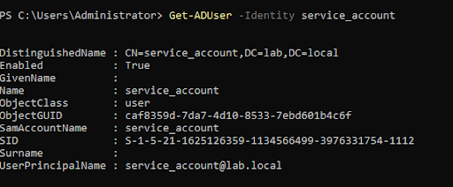
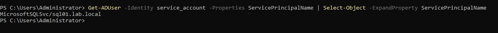

For Kerberoasting attack, created a service account which is going to be the victom.

Full Name: service_account
User Logon Name: service_account@lab.local
Password: Abcdefg@123

Also, created SPN manually and mapped to the service account that is created

