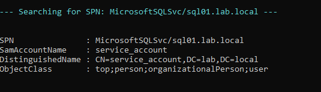
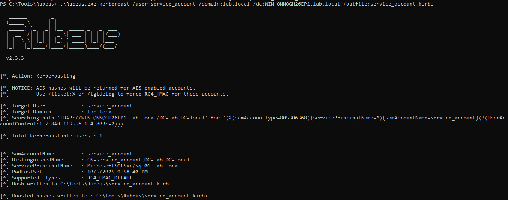

## Detection Validation Playbook: Kerberoasting (T1558.003)

This playbook documents the TTP emulation, log analysis, and response procedure for the Kerberoasting attack, serving as a comprehensive detection validation document. 

Field | Detail|
-------|-------|
TTP | T1558.003 - Steal or Forge Kerberos Tickets: Kerberoasting|
Objective | Validate the detection and response capability for Kerberos Service Ticket hash extraction against an Active Directory environment.|
Environment | Domain: lab.local / DC: WIN-QNNQGH26EP1.lab.local|
Tools Used | Rubeus, PowerView, Hashcat/John The Ripper, Splunk|

## Offensive Steps

This Section documents the precise steps taken to emulate the attacker's TTP, resulting in the generation of detectable log data.

1.1 Pre-requisites

- Make sure to create service account which is going to be victim.
- Create SPN manually and map that to the service account created.
- Make sure to install the required tools (Installing Rubeus, PowerView, John The Ripper/Hashcat)

1.2 Reconnaissance

PowerView is the toolkit used here for the AD reconnaissance to identify service accounts with an assigned Service Principal Name (SPN) that are vulnerable to kerberoasting.



The above image gives you the service account that is targeted.

**Target Identified:** `service_account@lab.local` with SPN `MicrosoftSQLSvc/sql01.lab.local`

### Operational Notes

**Reconnaissance is critical** - because it gives you the details of the SPN and respective SamAccountName. After reconnaissance, you can choose which SPN is weak and feel targeted for kerberoasting.

**Account Evasion** - Avoid SPNs owned by: krbtgt, Administrator, Domain Admins, DC machine accounts, kadmin/changepw since it will be hard to crack.

1.3 Hash Extraction

**Goal:** Request a Kerberos Service Ticket (TGS) for the target SPN and extract the password hash for offline cracking using Rubeus (configured with dependencies: Visual Studio, .NET Framework)

```bash
.\Rubeus.exe kerberoast /user:service_account /domain:lab.local /dc:WIN-QNNQGH26EP1.lab.local /outfile:service_account.kirbi
```




