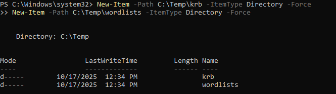
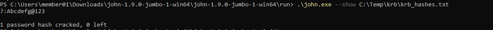
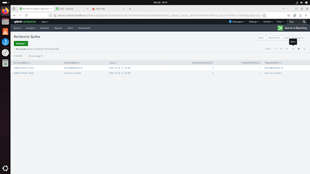

# Detection Validation Playbook: Kerberoasting (T1558.003)

This playbook documents the TTP emulation, log analysis, and response procedure for the Kerberoasting attack, serving as a comprehensive detection validation document. 

Field | Detail|
-------|-------|
TTP | T1558.003 - Steal or Forge Kerberos Tickets: Kerberoasting|
Objective | Validate the detection and response capability for Kerberos Service Ticket hash extraction against an Active Directory environment.|
Environment | Domain: lab.local / DC: WIN-QNNQGH26EP1.lab.local|
Tools Used | Rubeus, PowerView, Hashcat/John The Ripper, Splunk|

# 1. Offensive Steps

This Section documents the precise steps taken to emulate the attacker's TTP, resulting in the generation of detectable log data.

## 1.1 Pre-requisites

- Make sure to create service account which is going to be the victim.
- Create SPN manually and map that to the service account created.
- Make sure to install the required tools (Installing Rubeus, PowerView, John The Ripper/Hashcat)

Also make sure to enable the audit policy for Kerberos Service Ticket Operations since it will not be enabled by default


## 1.2 Reconnaissance (need to add goal)

PowerView is the toolkit used here for the AD reconnaissance to identify service accounts with an assigned Service Principal Name (SPN) that are vulnerable to kerberoasting.


The above image gives you the service account that is targeted.

**Target Identified:** `service_account@lab.local` with SPN `MicrosoftSQLSvc/sql01.lab.local`

### Operational Notes

**Reconnaissance is critical** - because it gives you the details of the SPN and respective SamAccountName. After reconnaissance, you can choose which SPN is weak and feel targeted for kerberoasting.

**Account Evasion** - Avoid SPNs owned by: krbtgt, Administrator, Domain Admins, DC machine accounts, kadmin/changepw since it will be hard to crack.

## 1.3 Hash Extraction

**Goal:** Request a Kerberos Service Ticket (TGS) for the target SPN and extract the password hash for offline cracking using Rubeus configured with dependencies: 
- Visual Studio - to read .sln and .cs files and converted the file as an executable rubeus.exe file
- .NET Framework - For pre-built libraries and run-time support

```bash
.\Rubeus.exe kerberoast /user:service_account /domain:lab.local /dc:WIN-QNNQGH26EP1.lab.local /outfile:service_account.kirbi
```


Three things happen soon after I run the above command:

- Rubeus asked Active Directory (the Domain Controller) to issue a Kerberos service ticket (TGS) for the service account service_account that owns the SPN MicrosoftSQLSvc/sql01.lab.local

- The Domain Controller logged an event **EventID 4769** (“A Kerberos service ticket was requested”) in the DC’s Security log.

- Rubeus creates on-disk artifacts (to a file `C:\Tools\Rubeus\service_account.kirbi`)) which I can keep as evidence or feed into cracking tools. Also it provides useful metadata like encryption type, PwdLastSet, etc.

### Operational Notes

The file the is obtained now from kerberoasting only contains hash for offline cracking not the full ticket. So, if you try Pass-The-Ticket (PTT) with this file, it will not work. For obtaining, .kirbi binary file, a different command should be ran, which can then be used for PTT.

## 1.4 Offline Cracking (John The Ripper)

**Goal:** Use the extracted TGS hash and do offline cracking to determine the plaintext password

### Pre-requisities

- Prepare the workfolder and wordlist



- Copy or move the hash file to working folder /Temp/krb

- Prepare the wordlist and store it inside the wordlist folder

```bash
"https://raw.githubusercontent.com/danielmiessler/SecLists/master/Passwords/Common-Credentials/10k-most-common.txt" -OutFile "C:\Temp\wordlists\10k-most-common.txt"
```

### Run offline cracking (John The Ripper)


```bash
cd “john.exe folder” .\john.exe --pot=./fresh_run.pot --wordlist=C:\Temp\wordlists\10k-most-common.txt C:\Temp\krb\krb_hashes.txt
```

### Proof of Compromise

Once done, to show the cracked hashes run the following command:

```bash
.\john.exe --show C:\Temp\krb\krb_hashes.txt
```



**Plain Text Password:** Abcdefg@123

# 2. Defensive Steps

This section dtails the splunk correlation logic and the evidence of detection validation

## 2.1 Log Source and Artifact

- Source: Windows Security Event Log on the Domain Controller

- Critical Event: Event ID 4769 ("A Kerberos service ticket was requested")

- Correlation Sign: A spike in Event ID 4769, specifically a single AccountName (the attacker) requesting service tickets for multiple unique ServiceName (SPNs) within a short time window.

## 2.2 Splunk SPL Query

Kerberos trace detected in the Ubuntu SIEM Splunk


```bash
index=wineventlog sourcetype="XmlWinEventLog:Security" 
| spath 
| rex field=_raw "<Data Name='ServiceName'>(?<ServiceName>[^<]+)</Data>" 
| rex field=_raw "<Data Name='AccountName'>(?<AccountName>[^<]+)</Data>" 
| rex field=_raw "<EventID>(?<EventID>\d+)</EventID>"
| search EventID=4769
```
The above splunk query successfully trace the Kerberos Service Ticket Operation.

In real time, just one Kerberos Service Ticket Operation doesn't concluded as an incident. There will be a spike in **Event ID 4769** since it tries to get TGS for various service accounts and crack the passwords offline. 

So, the signs that are need to be considered is either TGS requests from an unusual account name or a spike in Event ID 4769 where a particular account name requests a service ticket for multiple service accounts in a short span of time.

```bash
index=wineventlog sourcetype="XmlWinEventLog:Security" 
| spath 
| rex field=_raw "<EventID>(?<EventID>\d+)</EventID>" 
| search EventID=4769
| rex field=_raw "<Data Name='TargetUserName'>(?<AccountName>[^<]+)</Data>"
| rex field=_raw "<Data Name='ServiceName'>(?<ServiceName>[^<]+)</Data>"
| bucket _time span=1m
| stats count as ServiceTicketCount, dc(ServiceName) as UniqueSPNCount, values(ServiceName) as TargetedSPNs by AccountName, ServiceName _time
| where ServiceTicketCount > 5
| sort _time desc
```

The Splunk query successfully returns the Source Account that executed Rubeus [Report attached below], confirming the high volume of TGS requests. In real time, the TGS request will be made for multiple service account from a single source causing a spike and collect all those hash file which will be used for offline cracking.



This same SPL query can be Saved As for configuring alerts in Splunk so that an alert action could be performed for handling the incident effectively. 

**Conclusion:** The logic successfully detects the anomalous behavior associated with Kerberoasting, validating the rule against TTP T1558.003.


# 3. Incident Response


| Phase | Action and Execution Details |
--------------|------------------------------|
Containment | Immediately disable the attacker's source account. Using Powershell `Disable-ADAccount -Identity "member01@lab.local"`. This stops further TGS requests and immediate malicious activity.|
Eradication | Reset the target password and force a complex password reset on the compromised service account (service_account@lab.local). This invalidates the plaintext password obtained by the attacker.|
Triage | Isolate the source host member01@lab.local. Make sure to check for persistence mechanisms and lateral movement attempts.|


